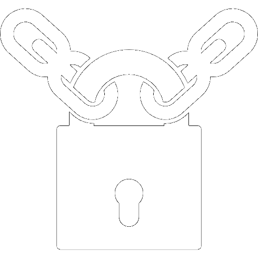
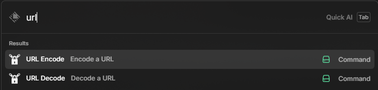

# URL Encoder/Decoder

A Raycast extension that allows encoding and decoding URLs, escaping or unescaping special characters to create compliant and functioning URLs.



## Features

- **URL Encode**: Converts special characters into escaped syntax using `encodeURIComponent()`
- **URL Decode**: Unescapes special characters using `decodeURIComponent()`
- Copy results to clipboard with a keyboard shortcut (Ctrl+Enter)
- Simple and intuitive interface
- Works on both Windows and macOS

## Installation

### Prerequisites

- [Raycast](https://raycast.com/) installed on your system
- Node.js and npm

### From Raycast Store

1. Open Raycast
2. Search for "URL Encoder/Decoder"
3. Click "Install"

### Manual Installation

1. Clone this repository:
   ```
   git clone https://github.com/seanmcilvenna/url-encoder-decoder.git
   ```

2. Navigate to the project directory:
   ```
   cd url-encoder-decoder
   ```

3. Install dependencies:
   ```
   npm install
   ```

4. Build and install the extension:
   ```
   npm run build
   ```

## Usage

### URL Encode

1. Open Raycast
2. Type "URL Encode"
3. Enter the text you want to encode
4. The encoded result will appear below
5. Press Ctrl+Enter to copy the result to your clipboard

### URL Decode

1. Open Raycast
2. Type "URL Decode"
3. Enter the encoded text you want to decode
4. The decoded result will appear below
5. Press Ctrl+Enter to copy the result to your clipboard

## Examples

### URL Encode Example

Input:
```
https://example.com/path?name=John Doe&age=30
```

Output:
```
https%3A%2F%2Fexample.com%2Fpath%3Fname%3DJohn%20Doe%26age%3D30
```

### URL Decode Example

Input:
```
https%3A%2F%2Fexample.com%2Fpath%3Fname%3DJohn%20Doe%26age%3D30
```

Output:
```
https://example.com/path?name=John Doe&age=30
```

## Development

### Available Scripts

- `npm run dev`: Run the extension in development mode
- `npm run lint`: Lint the code
- `npm run fix-lint`: Fix linting issues
- `npm run build`: Build the extension
- `npm run publish`: Publish the extension to Raycast Store

## License

This project is licensed under the MIT License - see the LICENSE file for details.

## Author

Created by [seanmcilvenna](https://github.com/seanmcilvenna)

## Changelog

See [CHANGELOG.md](CHANGELOG.md) for version history and release notes.

## Screenshots


*URL Encoder interface showing text input and encoded result*


*URL Decoder interface showing encoded input and decoded result*


*URL "Encode" and "Decode" commands from the main RayCast menu*